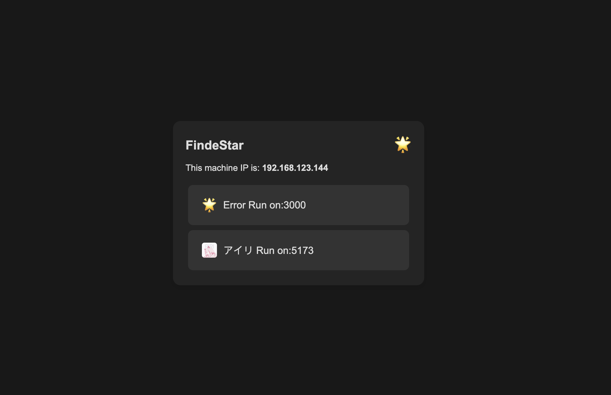

# FindeStar
FindeStar-Navigation Page With Network Discovery

<p align="center">
  <picture>
    
  </picture>
</p>

A simple navigation page based on the Go + Gin framework with a local web port discovery service.  
It aims to solve the problem of repeatedly writing navigation pages in environments with variable IP addresses.

## Run Directly & Develop:
```
go run main.go
```

### Access:
```
http://localhost
```

## Build Docker Image:
```
docker build -t FindeStar .
```

### Run Container:
```
docker run -d --name FindeStar -p <YOUR-PORT>:80 FindeStar
```

### Access:
```
http://<example>.local:<YOUR-PORT>
```

## 中文：

一个基于 Go + Gin 框架带有本地Web端口发现服务的简单导航页，为了解决在可变的IP地址环境下需要重复编写导航页面的问题。

## 直接运行&开发：

```
go run main.go
```
### 访问：
```
http://localhost
```
## 构建 Docker 镜像:

```
docker build -t FindeStar .
```

### 运行容器:

```
docker run -d --name FindeStar -p <YOUR-PORT>:80 FindeStar
```

### 访问：

```
http://<example>.local:<YOUR-PORT>
```